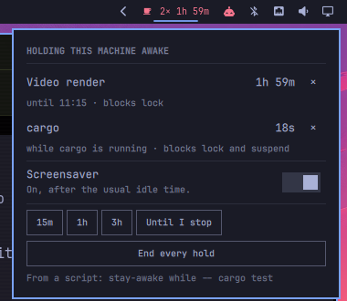

# Stay Awake Sessions

An Omarchy 4 (Quattro) shell plugin that keeps this machine awake **for a reason
that ends by itself**.

Omarchy already ships a Stay Awake toggle. A toggle is a switch you have to
remember to flip back, and the thing people actually want is the one Amphetamine
sold on macOS: *stay awake **while** this is true*. A deadline, a build, a
container, a login session. When the reason is over, the hold is over.

```bash
stay-awake for 90m                       # until half past
stay-awake until 17:00                   # until a wall-clock time
stay-awake while -- cargo test           # exactly as long as the command runs
stay-awake while-process ffmpeg          # while a process is alive
stay-awake while-command 'who | grep -q pts'   # while any condition holds
```

The bar widget shows what is holding the machine and how long is left. Every
hold ends with a notification saying why.



## Install

```bash
omarchy plugin add https://github.com/Ignibyte/omarchy-stay-awake-sessions.git
omarchy plugin enable ignibyte.stay-awake-sessions right
```

The plugin lands disabled so you can read the code first, which is worth doing:
Omarchy plugins run unsandboxed inside `omarchy-shell`, with your permissions.

For the command line, put its `bin` on your `PATH`:

```bash
ln -s ~/.config/omarchy/plugins/ignibyte.stay-awake-sessions/bin/stay-awake ~/.local/bin/stay-awake
```

### Removal

```bash
omarchy plugin disable ignibyte.stay-awake-sessions
omarchy plugin remove ignibyte.stay-awake-sessions
rm -f ~/.local/bin/stay-awake
rm -rf ~/.local/state/omarchy/stay-awake-sessions
```

Disabling releases any hold the plugin is keeping, so the machine goes back to
its usual timers. Nothing outside those paths is touched: the plugin writes only
its own state directory and the Stay Awake flag Omarchy already owns, and it
adds one entry to `~/.config/omarchy/shell.json`, which `omarchy plugin remove`
takes back out.

### Requirements

Omarchy 4 (Quattro). Beyond what Omarchy already installs, it uses `bash`,
`pgrep` (procps-ng), `systemd-inhibit` and `notify-send` (libnotify) — all
present on a stock Omarchy box. The CLI wrapper also uses `jq`.

## The bar widget

| | |
|---|---|
| Left click | Open the panel: what is held, and buttons to start or end a hold |
| Right click | Hold for the default duration, or release everything |
| Middle click | Release everything |

While nothing is held the cup sits dimmed in the bar. While something is, it
lights up and carries the next deadline beside it (`󰅶 1h 04m`), or the name of
whatever is holding it when there is no deadline.

## Holds

Every hold is a **session**: a label, a condition, and what it blocks.

| Condition | What ends it |
|---|---|
| `for <duration>` | The clock. `90m`, `2h`, `1h30m`, `45s`, or a bare number as minutes |
| `until <HH:MM>` | A wall-clock time, today or tomorrow, whichever is next |
| `while -- <command>` | The command exiting. No polling: the hold is tied to the child process |
| `while-process <pattern>` | No process matches the pattern any more (`pgrep -f`) |
| `while-command <shell>` | The command stops exiting 0 |
| `on` | Nothing. It holds until you end it |

Conditions are re-checked every few seconds, and a condition is allowed to read
false for a grace period before its hold ends — long enough that the gap between
two `cargo` invocations in one script does not drop the hold.

`stay-awake while -- <command>` is the one to reach for in a script. It needs no
polling and no pattern, because the hold lives and dies with the child process:

```bash
stay-awake while --scope all -- ./bin/gate.sh --full-regression
```

## What a hold blocks

`--scope` picks the lever:

| Scope | Effect |
|---|---|
| `screen` | The screensaver only. The screen still locks on time |
| `idle` (default) | The screensaver and the lock, through Omarchy's own Stay Awake flag |
| `sleep` | Suspend and hibernate, through a logind `idle:sleep` inhibitor |
| `all` | `idle` and `sleep` together |

`screen` is the one for watching something. Omarchy's Stay Awake flag stops the
screensaver and the lock together, but their timeouts are two separate numbers
in `shell.json`, so pushing `idle.screensaver` past `idle.lock` stops the
screensaver on its own and leaves the lock firing on schedule:

```bash
stay-awake while-process mpv --scope screen --label "Watching something"
```

## The screensaver switch

Some people just never want the screensaver. That is a preference, not a hold,
so it gets its own switch — in the panel, and on the command line:

```bash
stay-awake screensaver off       # the screen still locks on its usual timer
stay-awake screensaver on
stay-awake screensaver toggle
```

The switch persists across restarts, because it edits `idle.screensaver` in
your `shell.json` and puts your own value back when you turn it on again. Your
original timeout is remembered, and the plugin will never mistake its own
suppression for your setting.

## Options

Set these on the widget in Setup > Plugins, or on its entry in
`~/.config/omarchy/shell.json`:

| Key | Default | What it does |
|---|---|---|
| `defaultMinutes` | `60` | The one-click hold's length |
| `defaultScope` | `idle` | What a hold blocks when `--scope` is not given |
| `pollSeconds` | `5` | How often a process or command condition is re-checked |
| `graceSeconds` | `15` | How long a condition may read false before its hold ends |
| `notify` | `true` | Notify when a hold ends |
| `showWhenIdle` | `true` | Keep the cup in the bar when nothing is held |

## How it plays with the stock toggle

The plugin drives the same flag the built-in Stay Awake indicator does, and
hands it back the way it found it. Turn Stay Awake on by hand, run a session,
and when the session ends the flag is still on.

Switching Stay Awake **off** by hand while sessions are running ends them. You
asked for the machine to sleep; the sessions do not argue.

If the shell dies while a hold is live, the flag would outlive the process that
took it, leaving a machine that never sleeps and nothing on screen to say why.
The plugin leaves a breadcrumb at
`~/.local/state/omarchy/stay-awake-sessions/hold` and releases any hold it finds
there whose shell is gone. Recovery only ever releases: after a crash there is
no way to tell a flag you set by hand from one a dead hold left switched on, and
of the two possible mistakes, a machine that never sleeps is the worse one.

## From the command line without the wrapper

The plugin registers a `stayawake` IPC target:

```bash
omarchy-shell stayawake status
omarchy-shell stayawake list
omarchy-shell stayawake hold 'for=90m label="Render" scope=all'
omarchy-shell stayawake hold '{"while-process":"ffmpeg","label":"Encoding"}'
omarchy-shell stayawake end 3
omarchy-shell stayawake endAll
omarchy-shell stayawake toggle
```

A spec is either `key=value` pairs or JSON. `hold` returns the new session's id.

## Development

The plugin is a git checkout in `~/.config/omarchy/plugins/`. Saving a file
reloads the plugin in place; `omarchy-shell shell rescanPlugins` forces it.

`SessionModel.js` holds every decision about durations, conditions and
formatting as plain functions, so the logic can be read and exercised without a
running shell. `Service.qml` owns the sessions and the two levers. `BarWidget.qml`
is the face. `bin/eval-predicates` checks every watched condition in one pass;
it takes its table base64-encoded on argv on purpose, because a pattern passed
in the clear would sit in the checker's own command line and `pgrep -f` would
match the process doing the matching.

## Licence

MIT. See [LICENSE](LICENSE).
